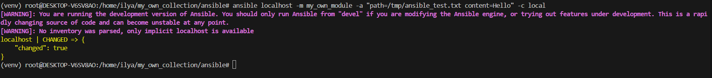
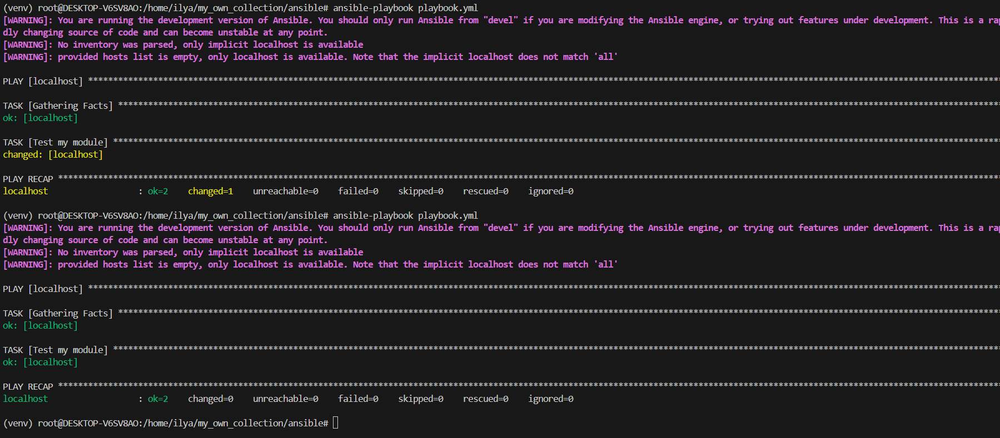
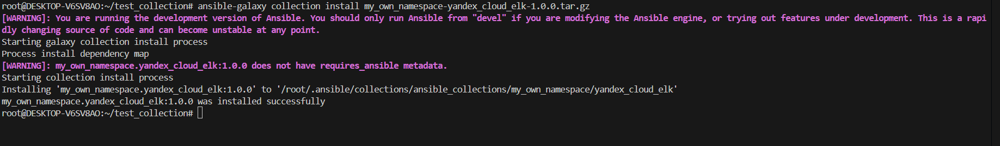
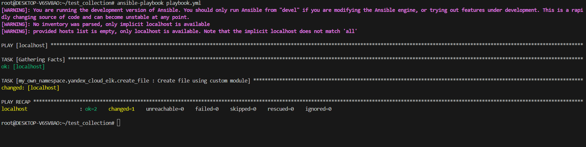

# # Ansible Collection: Домашнее задание к занятию «Создание собственных модулей» студента Аль-Ассафа Ильи

Скриншоты выполнения

В репозитории приложены скриншоты:

Шаг 4 — локальный запуск модуля

Шаг 6 — проверка идемпотентности

Шаг 15 — установка collection из архива

Шаг 16 — запуск playbook

